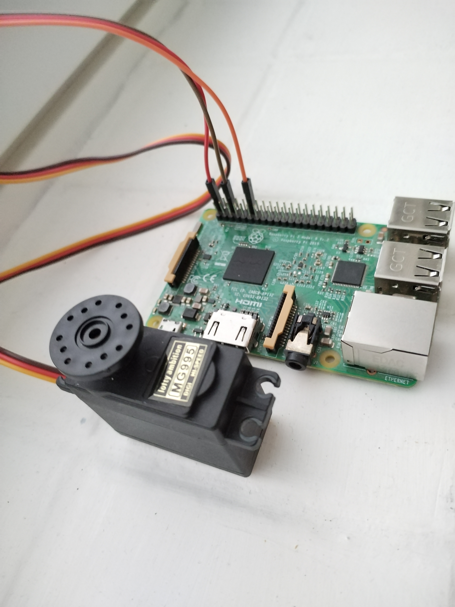

# Servo Controller via Bluetooth RFCOMM
This project establishes a Bluetooth RFCOMM connection between a controller and a user interface, enabling the control of servo motors. Servos can be used to control various devices, from car mirrors to robotic arms.
<table>
  <tr>
    <td align="right">
      
    </td>
    <td>
      <p style="margin-top: 0; font-weight: bold; font-size: 18px;">Server Side Servo and Rasp</p>
      <p>Uses the Rasp as the server. Any microcontroller can be used with pins.
      </p>
      You can do this with Software generated pwm signals to you dont need a pwm pin. But the signal from pwm pin is more precise.</p>You can use wifi or bluetooth for remote controlling.</p>
    </td>
  </tr>
</table>


## GTK GUI - gtk4

- **SERVO APP** Main menu window.

- **Fast Controls** Quickly move the servo to 0, 90, or 180 degrees.

- **Slider Control** Smooth and precise servo movement.

- **Save User** Requests the current position from the server, saves it, and stores the user's name in a JSON file on the user's side.

- **Load User** Load user settings and position. It moves the servo to the position saved with "Save User."

## Features

- Bluetooth Classic / RFCOMM communication.
- Two sliders for controlling two servo motors.
- Servos can be controlled via either software or hardware PWM signals.
- User-friendly GTK GUI for controlling the servos.
- Supports digital mode servo control.

## Libraries Used

### Server Side
- **WiringPi**: This library is used for the low-level control for Raspberry.

### Connection
- **Bluetooth**: The connection is build with the low level bluetooth libary with.

### User Side
- **Gtk**: The graphical user interface is built using the Gtk library, providing a smooth and interactive control experience.

## Getting Started

To get started with this project, follow these steps:

1. [Installation](#installation): Set up the required libraries and dependencies.
2. [Usage](#usage): Learn how to use the software and control the servos.
3. [Troubleshooting](#troubleshooting): Find solutions to common issues.
4. [Contributing](#contributing): Contribute to the project and make it better.
5. [License](#license): Understand the project's licensing terms.

## Installation

To use this servo controller, you need to install the required libraries:

```bash
sudo apt install libgtk-4-dev  # Install for the GUI
sudo apt install wiringpi  # Install for the pin control
sudo apt-get install libbluetooth-dev # Install for communication
 